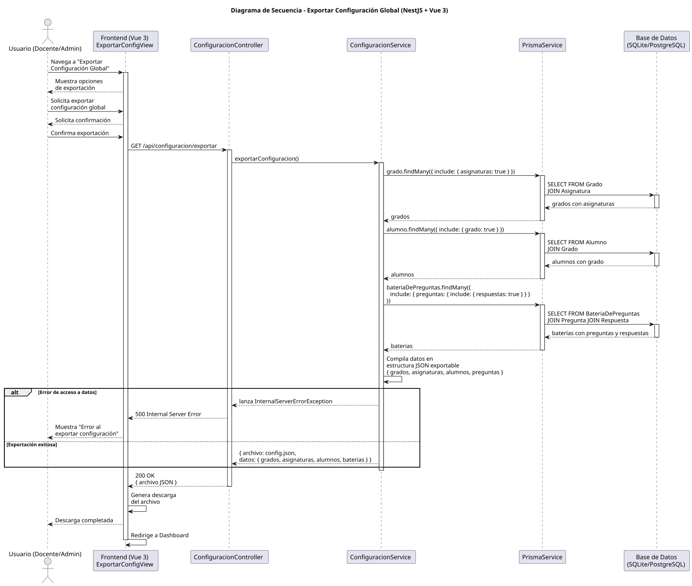
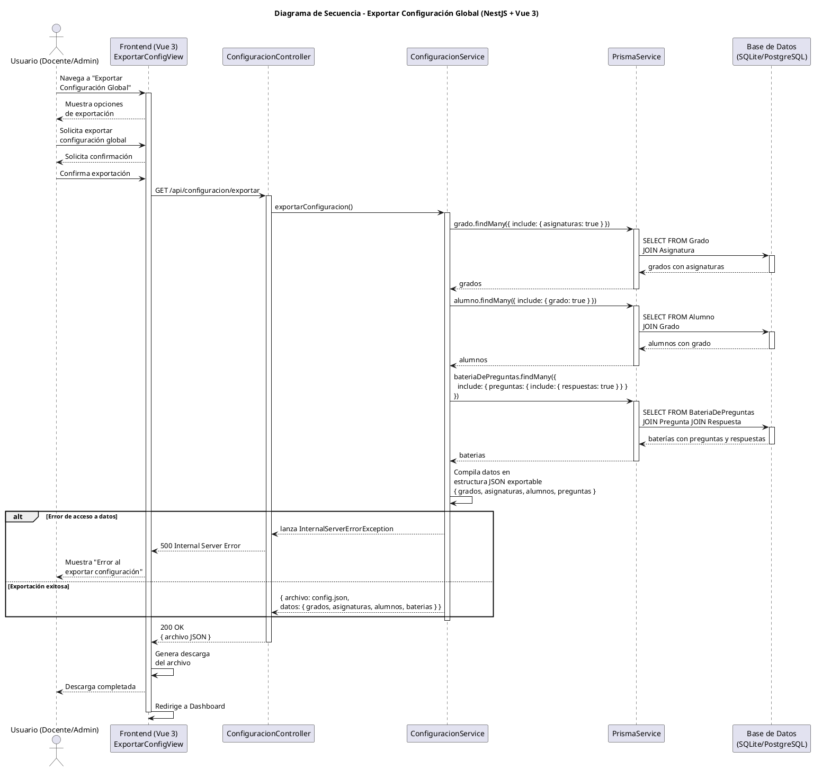

# 25-26-idsw2-sdVC > exportarConfiguracionGlobal > Diseño

## Información del artefacto

| Campo | Valor |
|-------|-------|
| **Proyecto** | Sistema de Gestión de Exámenes Universitarios |
| **Fase RUP** | Elaboración |
| **Disciplina** | Diseño |
| **Versión** | 1.0 (NestJS + Vue 3) |
| **Fecha** | 2026-06-03 |
| **Autor** | Equipo de desarrollo |

## Propósito

Detallar la interacción entre los componentes del sistema para exportar la configuración global del sistema (grados, asignaturas, alumnos, baterías de preguntas) a un archivo JSON descargable, recopilando todas las entidades mediante consultas independientes y compilándolas en una estructura exportable.

## Diagrama de secuencia de diseño

||
|-|
|Código fuente: [secuencia.puml](../../../modelosUML/diseno/exportarConfiguracionGlobal/secuencia.puml)|

## Código PlantUML

## Participantes

| Componente | Responsabilidad |
|---|---|
| **Frontend (Vue 3)** | ExportarConfigView que permite al usuario solicitar la exportación, confirmar la operación y descargar el archivo JSON generado. |
| **ConfiguracionController** | Endpoint REST `GET /api/configuracion/exportar` que recibe la solicitud de exportación y devuelve el archivo de configuración. |
| **ConfiguracionService** | Lógica de negocio para orquestar las consultas de todas las entidades del sistema y compilarlas en una estructura JSON exportable. |
| **PrismaService** | Capa ORM que ejecuta las consultas independientes con los includes necesarios para obtener datos anidados. |
| **Base de Datos (SQLite/PostgreSQL)** | Almacena todas las entidades del sistema que serán consultadas para la exportación. |

## Decisiones de diseño

| Decisión | Justificación |
|---|---|
| **Consultas independientes por entidad** | Se realizan consultas separadas para grados (con asignaturas), alumnos y baterías/preguntas en lugar de una sola consulta gigante, mejorando la legibilidad y el mantenimiento. |
| **Formato JSON exportable** | JSON es el formato natural para datos jerárquicos y compatible con la operación inversa `importarConfiguracionGlobal()`, que leería el mismo formato. |
| **Compilación en el servicio** | `ConfiguracionService` compila la estructura final del JSON, manteniendo el controlador limpio como mera puerta de entrada REST. |
| **Descarga gestionada por el frontend** | El backend devuelve el JSON; el frontend genera la descarga (Blob + download link), siguiendo el patrón SPA estándar. |
| **Confirmación previa obligatoria** | El usuario debe confirmar antes de realizar las consultas, evitando peticiones innecesarias a la base de datos. |
| **Incluir respuestas con preguntas** | Las preguntas se exportan con sus respuestas asociadas para que el archivo sea autocontenido y permita una importación completa. |
| **Servicio dedicado reutilizable** | `ConfiguracionService` es el mismo que el de importación, manteniendo la lógica de configuración unificada en un solo módulo. |
| **Seguridad por capas** | `JwtAuthGuard` + `RolesGuard` protegen el endpoint. Solo usuarios con rol `DOCENTE` o `ADMIN` pueden exportar configuración. |

> **Nota:** Este caso de uso está priorizado como #4 pero no tiene implementación en código. El diseño propuesto es complementario a `importarConfiguracionGlobal()` y sigue los mismos patrones arquitectónicos del sistema.
