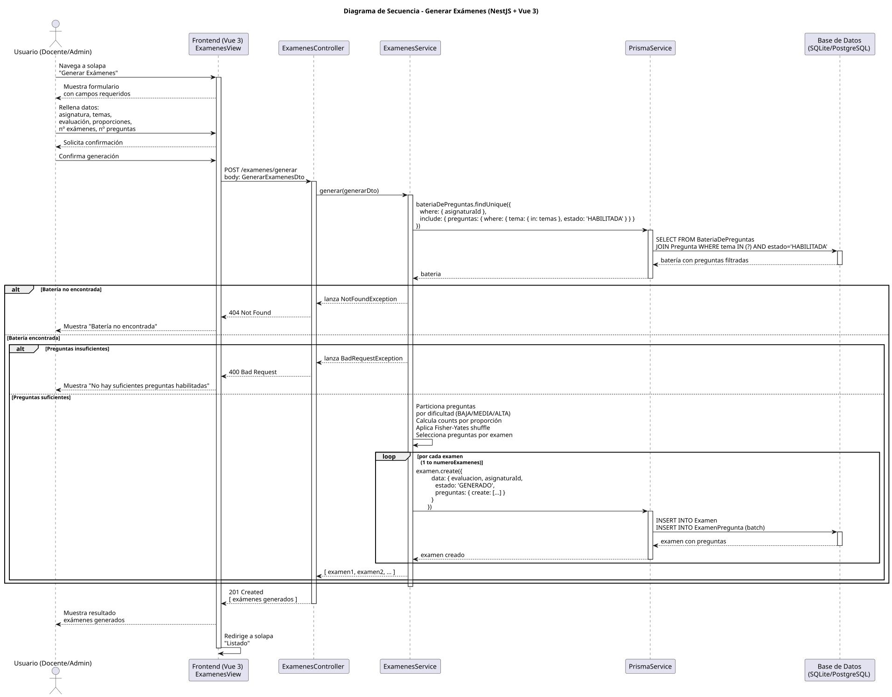
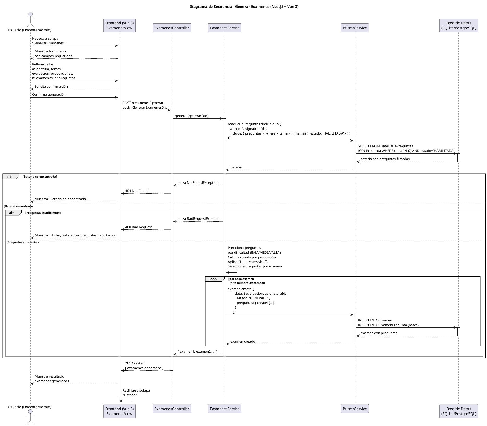

# 25-26-idsw2-sdVC > generarExamenes > Diseño

## Información del artefacto

| Campo | Valor |
|-------|-------|
| **Proyecto** | Sistema de Gestión de Exámenes Universitarios |
| **Fase RUP** | Elaboración |
| **Disciplina** | Diseño |
| **Versión** | 1.0 (NestJS + Vue 3) |
| **Fecha** | 2026-06-03 |
| **Autor** | Equipo de desarrollo |

## Propósito

Detallar la interacción entre los componentes del sistema (Frontend Vue 3, ExamenesController, ExamenesService, PrismaService) para generar exámenes de forma automática seleccionando preguntas de una batería según criterios de dificultad, tema y cantidad especificada por el docente.

## Diagrama de secuencia de diseño

||
|-|
|Código fuente: [secuencia.puml](../../../modelosUML/diseno/generarExamenes/secuencia.puml)|

## Código PlantUML

## Participantes

| Componente | Responsabilidad |
|---|---|
| **Frontend (Vue 3)** | ExamenesView que muestra el formulario de generación (asignatura, temas, evaluación, nº exámenes, nº preguntas, proporciones de dificultad), solicita confirmación, envía la petición al backend y redirige al listado de exámenes generados. |
| **ExamenesController** | Endpoint REST `POST /examenes/generar` que recibe el `GenerarExamenesDto` con los parámetros de generación. |
| **ExamenesService** | Lógica de negocio para obtener la batería de preguntas, filtrar por temas y estado habilitado, particionar por dificultad, aplicar selección aleatoria con Fisher-Yates shuffle según proporciones, y crear los exámenes batch en base de datos. |
| **PrismaService** | Capa ORM que abstrae el acceso a la base de datos. Proporciona métodos para consultar la batería con preguntas filtradas y crear exámenes con sus preguntas asociadas. |
| **Base de Datos (SQLite/PostgreSQL)** | Almacena baterías de preguntas, preguntas, exámenes y la relación entre ellos (ExamenPregunta). |

## Decisiones de diseño

| Decisión | Justificación |
|---|---|
| **Algoritmo de selección por dificultad** | Las preguntas se particionan por dificultad (BAJA, MEDIA, ALTA) y se seleccionan según proporciones especificadas por el docente, garantizando exámenes balanceados. |
| **Fisher-Yates shuffle** | Se aplica el algoritmo de Fisher-Yates para garantizar una distribución uniforme y pseudoaleatoria en la selección de preguntas de cada grupo de dificultad. |
| **Creación batch con loop** | Cada examen se crea individualmente con sus preguntas asociadas mediante `prisma.examen.create()` con `preguntas: { create: [...] }` en una sola transacción implícita. |
| **Validación de disponibilidad** | Se verifica que la batería exista y que contenga al menos `numeroPreguntas` preguntas habilitadas antes de comenzar la generación, evitando creaciones parciales. |
| **Relleno de preguntas restantes** | Si tras la selección por dificultad no se alcanza el número total de preguntas, se completa con preguntas aleatorias del pool restante para asegurar exámenes completos. |
| **Estado inicial GENERADO** | Todos los exámenes se crean con estado `GENERADO`, permitiendo diferenciar exámenes pendientes de asignar de aquellos ya en proceso. |
| **Lógica centralizada en el servicio** | Todo el algoritmo de selección y creación reside en `ExamenesService`, manteniendo el controlador como mera puerta de entrada REST. |
| **Seguridad por capas** | `JwtAuthGuard` + `RolesGuard` protegen el endpoint. Solo usuarios con rol `DOCENTE` o `ADMIN` pueden generar exámenes. |
