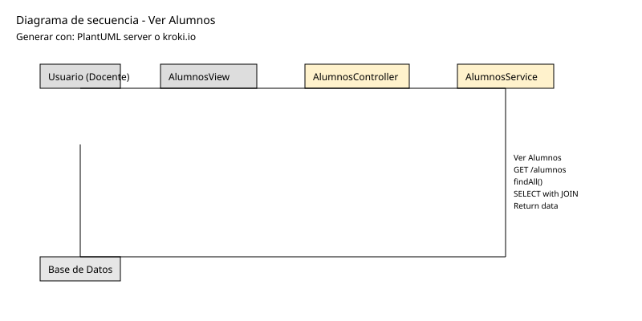
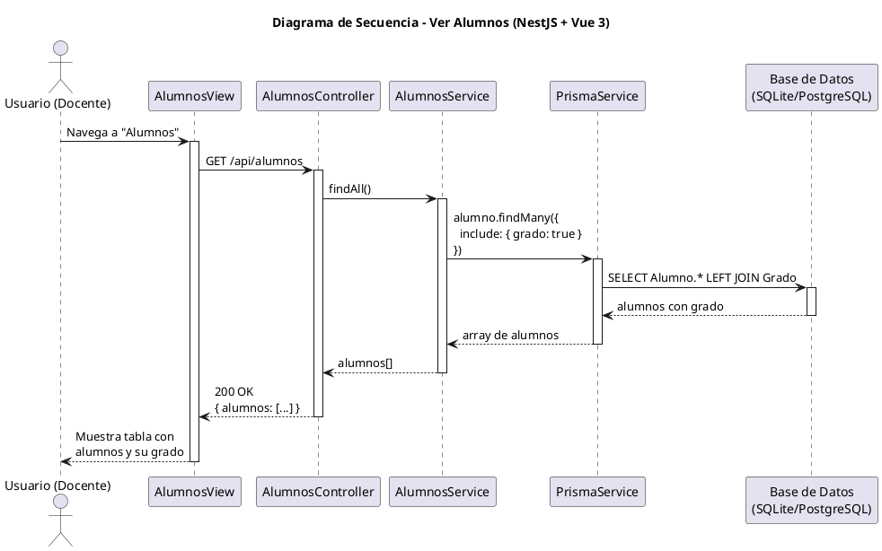

# 25-26-idsw2-sdVC > verAlumnos > Diseño

## Información del artefacto

| Campo | Valor |
|-------|-------|
| **Proyecto** | Sistema de Gestión de Exámenes Universitarios |
| **Fase RUP** | Elaboración |
| **Disciplina** | Diseño |
| **Versión** | 1.0 (NestJS + Vue 3) |
| **Fecha** | 2026-06-09 |
| **Autor** | Equipo de desarrollo |

## Propósito

Visualizar el listado de alumnos con su grado asociado. Caso de solo lectura.

## Diagrama de secuencia de diseño

||
|-|
|Código fuente: [secuencia.puml](../../../modelosUML/diseno/verAlumnos/secuencia.puml)|

## Código PlantUML

## Participantes

| Componente | Responsabilidad |
|---|---|
| **AlumnosView** | Vista que muestra tabla de alumnos con su grado. |
| **AlumnosController** | Endpoint `GET /api/alumnos`. |
| **AlumnosService** | Método `findAll()` con include de grado. |
| **PrismaService** | Capa ORM. |
| **Base de Datos** | Almacena alumnos y grados. |

## Decisiones de diseño

| Decisión | Justificación |
|---|---|
| **Include de grado** | Cada alumno incluye su grado asociado en una sola consulta. |
| **Sin filtros ni paginación** | Se muestran todos los alumnos. |
| **Caso de solo lectura** | Solo GET. |
| **Seguridad por capas** | Solo `DOCENTE` o `ADMIN`. |
| **Consulta eficiente** | Un solo `findMany` con JOIN. |
