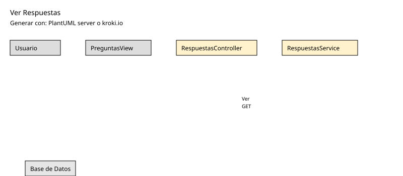

# 25-26-idsw2-sdVC > verRespuestas > Diseño

## Información del artefacto

| Campo | Valor |
|-------|-------|
| **Proyecto** | Sistema de Gestión de Exámenes Universitarios |
| **Fase RUP** | Elaboración |
| **Disciplina** | Diseño |
| **Versión** | 1.0 (NestJS + Vue 3) |
| **Fecha** | 2026-06-09 |
| **Autor** | Equipo de desarrollo |

## Propósito

Listar las respuestas asociadas a una pregunta específica.

## Diagrama de secuencia de diseño

||
|-|
|Código fuente: [secuencia.puml](../../../modelosUML/diseno/verRespuestas/secuencia.puml)|

## Participantes

| Componente | Responsabilidad |
|---|---|
| **PreguntasView** | Muestra detalle de pregunta y sus respuestas. |
| **RespuestasController** | GET /api/respuestas/pregunta/:preguntaId. |
| **RespuestasService** | findByPregunta() con filtro por preguntaId. |
| **PrismaService** | Capa ORM. |
| **Base de Datos** | Almacena respuestas. |

## Decisiones de diseño

| Decisión | Justificación |
|---|---|
| **Filtro por preguntaId** | Las respuestas siempre se ven en contexto de una pregunta. |
| **GET público (autenticado)** | Cualquier docente autenticado puede ver respuestas. |
