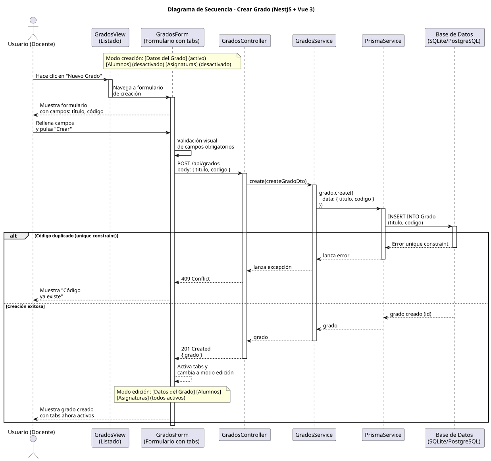
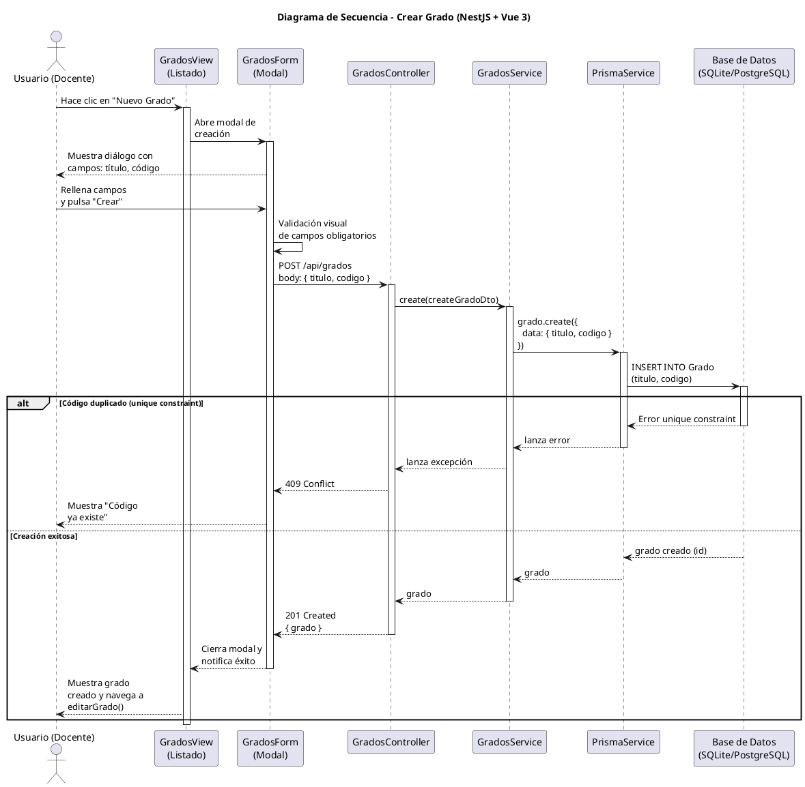

# 25-26-idsw2-sdVC > crearGrado > Diseño

## Información del artefacto

| Campo | Valor |
|-------|-------|
| **Proyecto** | Sistema de Gestión de Exámenes Universitarios |
| **Fase RUP** | Elaboración |
| **Disciplina** | Diseño |
| **Versión** | 1.0 (NestJS + Vue 3) |
| **Fecha** | 2026-06-09 |
| **Autor** | Marcos Gutierrez |

## Propósito

Detallar la interacción entre los componentes del sistema para crear un nuevo grado universitario, con validación de campos obligatorios y manejo de unicidad del código.

## Diagrama de secuencia de diseño

||
|-|
|Código fuente: [secuencia.puml](../../../modelosUML/diseño/crearGrado/secuencia.puml)|

## Código PlantUML

## Participantes

| Componente | Responsabilidad |
|---|---|
| **GradosView** | Vista que muestra el listado de grados. El usuario hace clic en "Nuevo Grado" para abrir el modal de creación. |
| **GradosForm** | Modal de creación con campos título y código, validación visual antes de enviar. |
| **GradosController** | Endpoint REST `POST /api/grados` protegido por `JwtAuthGuard` + `RolesGuard`. |
| **GradosService** | Método `create()` que persiste el grado mediante Prisma. |
| **PrismaService** | Capa ORM que ejecuta `grado.create()`. |
| **Base de Datos (SQLite/PostgreSQL)** | Almacena el grado. Valida unique constraint en `codigo`. |

## Decisiones de diseño

| Decisión | Justificación |
|---|---|
| **Validación visual en frontend** | El frontend valida campos obligatorios antes de enviar, evitando peticiones innecesarias. |
| **DTO con class-validator** | `CreateGradoDto` valida tipos y formato en backend mediante decoradores. |
| **Persistencia simple** | `GradosService.create()` es una operación directa — `prisma.grado.create()`. |
| **Manejo de error unique** | Si `codigo` ya existe, Prisma lanza `P2002` que NestJS convierte en 409 Conflict. |
| **Transición a editarGrado** | Tras crear, la vista navega a `GRADO_ABIERTO` para editar si es necesario. |
| **Seguridad por capas** | Solo usuarios `DOCENTE` o `ADMIN` pueden crear grados. |
| **Sin transaccionalidad explícita** | Operación atómica simple sin necesidad de transacción. |
| **Respuesta completa** | El endpoint devuelve el grado creado con su `id` generado. |
