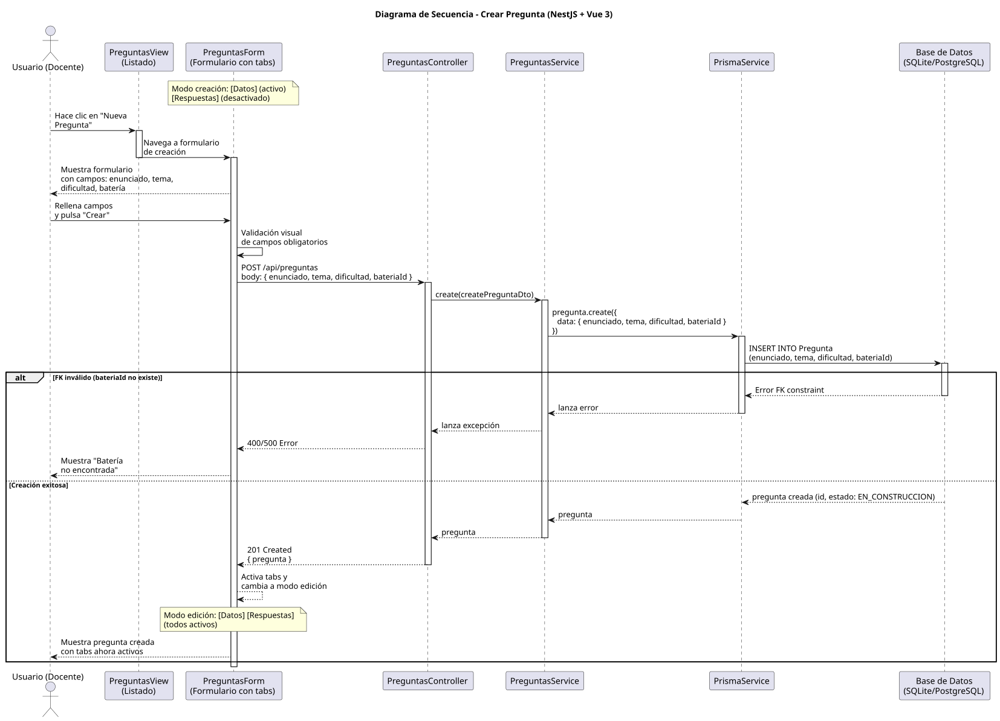
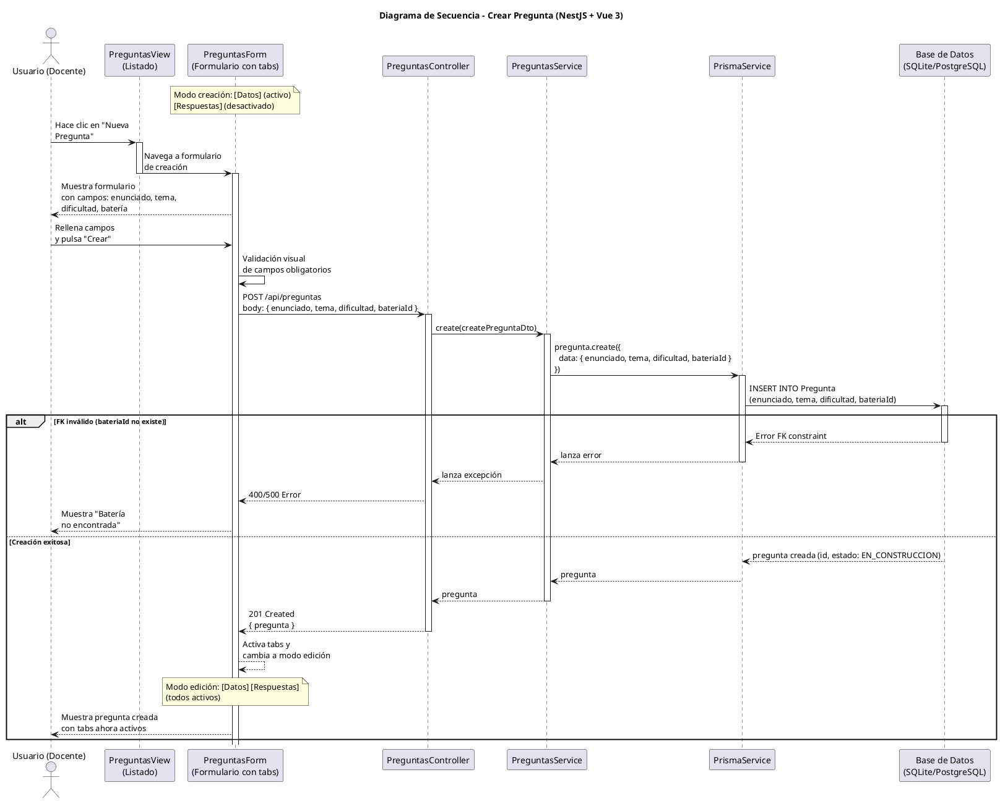

# 25-26-idsw2-sdVC > crearPregunta > Diseño

## Información del artefacto

| Campo | Valor |
|-------|-------|
| **Proyecto** | Sistema de Gestión de Exámenes Universitarios |
| **Fase RUP** | Elaboración |
| **Disciplina** | Diseño |
| **Versión** | 1.0 (NestJS + Vue 3) |
| **Fecha** | 2026-06-09 |
| **Autor** | Marcos Gutierrez |

## Propósito

Detallar la interacción entre los componentes del sistema para crear una nueva pregunta en el banco de preguntas, con validación de campos obligatorios y verificación de la batería de preguntas asociada.

## Diagrama de secuencia de diseño

||
|-|
|Código fuente: [secuencia.puml](../../../modelosUML/diseño/crearPregunta/secuencia.puml)|

## Código PlantUML

## Participantes

| Componente | Responsabilidad |
|---|---|
| **PreguntasView (Listado)** | Vista que muestra el listado de preguntas. El usuario hace clic en "Nueva Pregunta" para navegar al formulario de creación. |
| **PreguntasForm (Formulario con tabs)** | Formulario con tabs: [Datos] (activo), [Respuestas] (desactivado). En modo creación solo el tab de Datos está disponible. Tras crear, cambia a modo edición con todos los tabs activos. |
| **PreguntasController** | Endpoint REST `POST /api/preguntas` que recibe el DTO y delega en el servicio. Guard `JwtAuthGuard` + `RolesGuard` protegen el endpoint. |
| **PreguntasService** | Método `create()` que persiste la pregunta mediante Prisma. Sin validación explícita de batería — el FK constraint de la BD rechaza batería inválida. |
| **PrismaService** | Capa ORM que ejecuta `pregunta.create()` con los datos del DTO. |

## Decisiones de diseño

| Decisión | Justificación |
|---|---|
| **Validación visual en frontend** | El frontend valida campos obligatorios antes de enviar, evitando peticiones innecesarias. |
| **Creación sin validación explícita de batería** | La implementación actual de `PreguntasService.create()` no verifica la existencia de la batería antes de persistir. Prisma lanza error FK si `bateriaId` no existe, manejado por el error handler global. |
| **DTO con validación de NestJS** | `CreatePreguntaDto` usa `class-validator` para validar tipos y obligatoriedad de campos. |
| **Estado EN_CONSTRUCCION por defecto** | La pregunta se crea en estado `EN_CONSTRUCCION` según el schema de Prisma (default), permitiendo editarla antes de habilitarla. |
| **Transición automática a editarPregunta** | Tras crear, la vista navega a `PREGUNTA_ABIERTO` para que el docente añada respuestas inmediatamente. |
| **Manejo de error FK** | Si `bateriaId` es inválido, Prisma lanza `PrismaClientKnownRequestError` (P2003) que NestJS convierte en excepción HTTP. |
| **Seguridad por capas** | `JwtAuthGuard` + `RolesGuard` protegen el endpoint. Solo `DOCENTE` o `ADMIN` pueden crear preguntas. |
| **Sin transaccionalidad explícita** | La creación es una operación atómica simple (una sola tabla) que no requiere transacción. |
