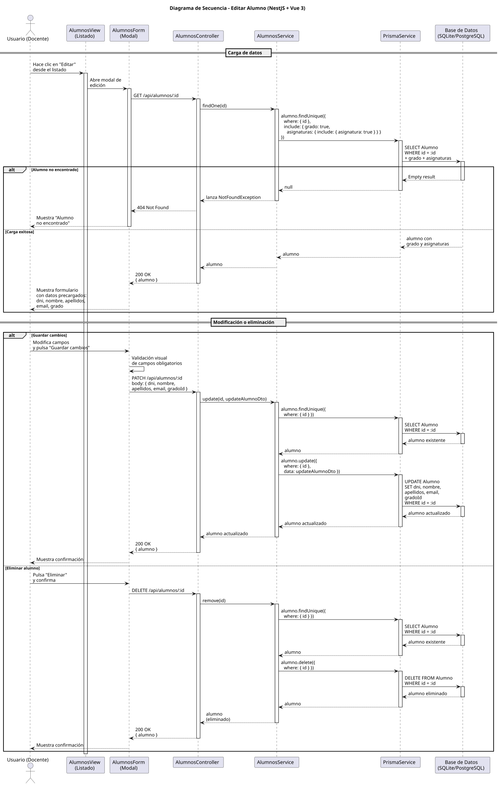

# 25-26-idsw2-sdVC > editarAlumno > Diseño

## Información del artefacto

| Campo | Valor |
|-------|-------|
| **Proyecto** | Sistema de Gestión de Exámenes Universitarios |
| **Fase RUP** | Elaboración |
| **Disciplina** | Diseño |
| **Versión** | 1.0 (NestJS + Vue 3) |
| **Fecha** | 2026-06-14 |
| **Autor** | Marcos Gutierrez |

## Propósito

Detallar la interacción entre los componentes del sistema para editar un alumno existente (modificar DNI, nombre, apellidos, email, grado) o eliminarlo, con verificación de existencia antes de cualquier operación y carga previa de datos con grado y asignaturas asociadas.

## Diagrama de secuencia de diseño

<div align=center>

||
|-|
|Código fuente: [secuencia.puml](../../../modelosUML/diseño/editarAlumno/secuencia.puml)|

</div>

## Código PlantUML

```plantuml
@startuml
title Diagrama de Secuencia - Editar Alumno (NestJS + Vue 3)

actor "Usuario (Docente)" as User
participant "AlumnosView" as FE
participant "AlumnosController" as Controller
participant "AlumnosService" as Service
participant "PrismaService" as Prisma
participant "Base de Datos\n(SQLite/PostgreSQL)" as DB

== Carga de datos ==

User -> FE: Hace clic en "Editar"\ndesde listado o vista
activate FE

FE -> Controller: GET /api/alumnos/:id
activate Controller

Controller -> Service: findOne(id)
activate Service

Service -> Prisma: alumno.findUnique({\n  where: { id },\n  include: { grado: true,\n    asignaturas: { include: { asignatura: true } } }\n})
activate Prisma
Prisma -> DB: SELECT Alumno\nWHERE id = :id\n+ grado + asignaturas
activate DB

alt Alumno no encontrado
  DB --> Prisma: Empty result
  deactivate DB
  Prisma --> Service: null
  deactivate Prisma
  Service --> Controller: lanza NotFoundException
  deactivate Service
  Controller --> FE: 404 Not Found
  FE --> User: Muestra "Alumno\nno encontrado"
  deactivate FE
  stop
else Carga exitosa
  DB --> Prisma: alumno con\ngrado y asignaturas
  deactivate DB
  Prisma --> Service: alumno
  deactivate Prisma
  Service --> Controller: alumno
  deactivate Service
  Controller --> FE: 200 OK\n{ alumno }
  deactivate Controller
  FE --> User: Muestra formulario\ncon datos precargados:\ndni, nombre, apellidos,\nemail, grado
end

== Modificación o eliminación ==

alt Guardar cambios
  User -> FE: Modifica campos\ny pulsa "Guardar cambios"
  FE -> FE: Validación visual\nde campos obligatorios

  FE -> Controller: PATCH /api/alumnos/:id\nbody: { dni, nombre,\napellidos, email, gradoId }
  activate Controller
  Controller -> Service: update(id, updateAlumnoDto)
  activate Service

  Service -> Prisma: alumno.findUnique({\n  where: { id } })
  activate Prisma
  Prisma -> DB: SELECT Alumno\nWHERE id = :id
  activate DB
  DB --> Prisma: alumno existente
  deactivate DB
  Prisma --> Service: alumno
  deactivate Prisma

  Service -> Prisma: alumno.update({\n  where: { id },\n  data: updateAlumnoDto })
  activate Prisma
  Prisma -> DB: UPDATE Alumno\nSET dni, nombre,\napellidos, email,\ngradoId\nWHERE id = :id
  activate DB
  DB --> Prisma: alumno actualizado
  deactivate DB
  Prisma --> Service: alumno actualizado
  deactivate Prisma

  Service --> Controller: alumno actualizado
  deactivate Service
  Controller --> FE: 200 OK\n{ alumno }
  deactivate Controller
  FE --> User: Muestra confirmación\ny navega a\nALUMNOS_ABIERTO2

else Eliminar alumno
  User -> FE: Pulsa "Eliminar"\ny confirma
  FE -> Controller: DELETE /api/alumnos/:id
  activate Controller
  Controller -> Service: remove(id)
  activate Service

  Service -> Prisma: alumno.findUnique({\n  where: { id } })
  activate Prisma
  Prisma -> DB: SELECT Alumno\nWHERE id = :id
  activate DB
  DB --> Prisma: alumno existente
  deactivate DB
  Prisma --> Service: alumno
  deactivate Prisma

  Service -> Prisma: alumno.delete({\n  where: { id } })
  activate Prisma
  Prisma -> DB: DELETE FROM Alumno\nWHERE id = :id
  activate DB
  DB --> Prisma: alumno eliminado
  deactivate DB
  Prisma --> Service: alumno
  deactivate Prisma

  Service --> Controller: alumno\n(eliminado)
  deactivate Service
  Controller --> FE: 200 OK\n{ alumno }
  deactivate Controller
  FE --> User: Muestra confirmación\ny navega a\nALUMNOS_ABIERTO4
end

deactivate FE

@enduml
```

## Participantes

| Componente | Responsabilidad |
|---|---|
| **AlumnosView** | Vista que muestra el diálogo de edición con datos precargados (DNI, nombre, apellidos, email, grado), permite modificar campos, guardar cambios, cancelar o eliminar el alumno. Validación visual antes de enviar. |
| **AlumnosController** | Endpoints REST `GET /api/alumnos/:id` (carga de datos), `PATCH /api/alumnos/:id` (actualización) y `DELETE /api/alumnos/:id` (eliminación). Guards `JwtAuthGuard` + `RolesGuard` protegen los endpoints, solo DOCENTE y ADMIN. |
| **AlumnosService** | Métodos `findOne()` (busca con `include: { grado: true, asignaturas: { include: { asignatura: true } } }`), `update()` (verifica existencia vía `findOne()` y luego persiste con Prisma) y `remove()` (verifica existencia vía `findOne()` y luego elimina). |
| **PrismaService** | Capa ORM que ejecuta `alumno.findUnique()`, `alumno.update()` y `alumno.delete()` sobre el modelo Alumno. |
| **Base de Datos (SQLite/PostgreSQL)** | Almacena y recupera los datos del alumno, incluyendo su grado y asignaturas asociadas. |

## Decisiones de diseño

| Decisión | Justificación |
|---|---|
| **Carga previa de datos antes de editar** | El frontend solicita `GET /alumnos/:id` al abrir la edición para precargar todos los campos del formulario, incluyendo grado y asignaturas asociadas. Esto permite al docente ver el estado actual completo antes de modificar. |
| **Verificación de existencia en update() y remove()** | Ambos métodos del servicio llaman a `findOne(id)` antes de operar. Si el alumno fue eliminado entre la carga y la acción, se lanza `NotFoundException` (404). Esto evita errores crípticos de Prisma. |
| **Inclusión de relaciones en findOne()** | `findOne()` incluye `grado` y `asignaturas { include: { asignatura: true } }` para que el formulario de edición pueda mostrar el nombre del grado y las asignaturas en las que está matriculado el alumno. |
| **Validación de datos con DTO de NestJS** | `UpdateAlumnoDto` usa `class-validator` para validar tipos y valores opcionales (permite PATCH parcial, solo actualizando los campos enviados). |
| **Validación visual en frontend** | El frontend valida campos obligatorios antes de enviar el PATCH, evitando peticiones innecesarias al servidor y mejorando la experiencia de usuario. |
| **Eliminación con confirmación** | Antes de enviar el DELETE, el frontend solicita confirmación al docente. Esto evita eliminaciones accidentales de alumnos del sistema. |
| **Seguridad por capas** | `JwtAuthGuard` + `RolesGuard` protegen los tres endpoints. Solo `DOCENTE` y `ADMIN` pueden editar o eliminar alumnos. El acceso no autorizado devuelve 401/403. |
| **DTO reutilizado entre creación y edición** | La estructura de `UpdateAlumnoDto` replica `CreateAlumnoDto` con todos los campos opcionales, lo que permite PATCH parcial y consistencia en la validación entre ambos casos de uso. |

## Trazabilidad con la implementación

| Capa | Artefacto real |
|------|----------------|
| Controlador | `src/apps/backend/src/alumnos/alumnos.controller.ts` (`PATCH /alumnos/:id`, `DELETE /alumnos/:id`, `GET /alumnos/:id`) |
| Servicio | `src/apps/backend/src/alumnos/alumnos.service.ts` (`update()`, `remove()`, `findOne()`) |
| DTO | `src/apps/backend/src/alumnos/dto/update-alumno.dto.ts` (`UpdateAlumnoDto`) |
| Vista | `src/apps/frontend/src/views/AlumnosView.vue` (diálogo de edición) |
| Modelo (BD) | `src/apps/backend/prisma/schema.prisma` (modelo `Alumno`) |
