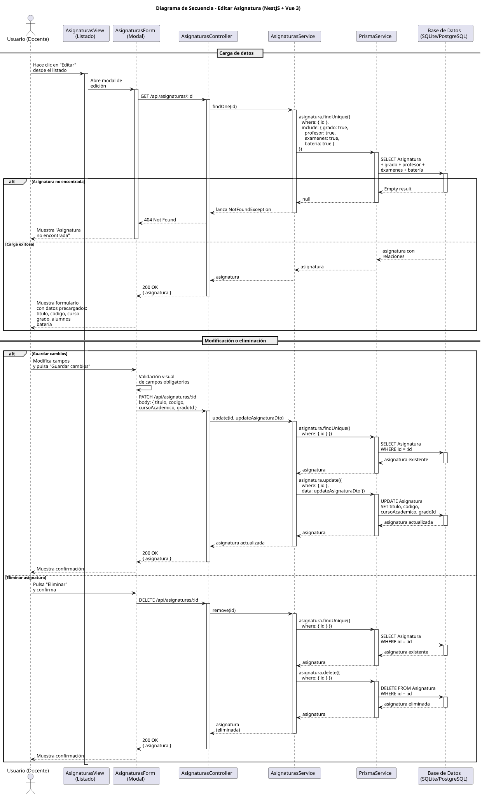

# 25-26-idsw2-sdVC > editarAsignatura > Diseño

## Información del artefacto

| Campo | Valor |
|-------|-------|
| **Proyecto** | Sistema de Gestión de Exámenes Universitarios |
| **Fase RUP** | Elaboración |
| **Disciplina** | Diseño |
| **Versión** | 1.0 (NestJS + Vue 3) |
| **Fecha** | 2026-06-14 |
| **Autor** | Marcos Gutierrez |

## Propósito

Detallar la interacción entre los componentes del sistema para editar una asignatura existente (modificar título, código, curso académico, grado) o eliminarla, con verificación de existencia antes de cualquier operación, carga previa de datos con relaciones (grado, profesor, exámenes, batería) y validación de campos en frontend.

## Diagrama de secuencia de diseño

<div align=center>

||
|-|
|Código fuente: [secuencia.puml](../../../modelosUML/diseño/editarAsignatura/secuencia.puml)|

</div>

## Código PlantUML

```plantuml
@startuml
title Diagrama de Secuencia - Editar Asignatura (NestJS + Vue 3)

actor "Usuario (Docente)" as User
participant "AsignaturasView" as FE
participant "AsignaturasController" as Controller
participant "AsignaturasService" as Service
participant "PrismaService" as Prisma
participant "Base de Datos\n(SQLite/PostgreSQL)" as DB

== Carga de datos ==

User -> FE: Hace clic en "Editar"\ndesde el listado
activate FE

FE -> Controller: GET /api/asignaturas/:id
activate Controller

Controller -> Service: findOne(id)
activate Service

Service -> Prisma: asignatura.findUnique({\n  where: { id },\n  include: { grado: true,\n    profesor: true,\n    examenes: true,\n    bateria: true }\n})
activate Prisma
Prisma -> DB: SELECT Asignatura\n+ grado + profesor +\néxamenes + batería
activate DB

alt Asignatura no encontrada
  DB --> Prisma: Empty result
  deactivate DB
  Prisma --> Service: null
  deactivate Prisma
  Service --> Controller: lanza NotFoundException
  deactivate Service
  Controller --> FE: 404 Not Found
  FE --> User: Muestra "Asignatura\nno encontrada"
  deactivate FE
  stop
else Carga exitosa
  DB --> Prisma: asignatura con\nrelaciones
  deactivate DB
  Prisma --> Service: asignatura
  deactivate Prisma
  Service --> Controller: asignatura
  deactivate Service
  Controller --> FE: 200 OK\n{ asignatura }
  deactivate Controller
  FE --> User: Muestra formulario\ncon datos precargados:\ntítulo, código, curso\ngrado, alumnos\nbatería
end

== Modificación o eliminación ==

alt Guardar cambios
  User -> FE: Modifica campos\ny pulsa "Guardar cambios"
  FE -> FE: Validación visual\nde campos obligatorios

  FE -> Controller: PATCH /api/asignaturas/:id\nbody: { titulo, codigo,\ncursoAcademico, gradoId }
  activate Controller
  Controller -> Service: update(id, updateAsignaturaDto)
  activate Service

  Service -> Prisma: asignatura.findUnique({\n  where: { id } })
  activate Prisma
  Prisma -> DB: SELECT Asignatura\nWHERE id = :id
  activate DB
  DB --> Prisma: asignatura existente
  deactivate DB
  Prisma --> Service: asignatura
  deactivate Prisma

  Service -> Prisma: asignatura.update({\n  where: { id },\n  data: updateAsignaturaDto })
  activate Prisma
  Prisma -> DB: UPDATE Asignatura\nSET titulo, codigo,\ncursoAcademico, gradoId
  activate DB
  DB --> Prisma: asignatura actualizada
  deactivate DB
  Prisma --> Service: asignatura
  deactivate Prisma

  Service --> Controller: asignatura actualizada
  deactivate Service
  Controller --> FE: 200 OK\n{ asignatura }
  deactivate Controller
  FE --> User: Muestra confirmación\ny navega a vista\nde la asignatura

else Eliminar asignatura
  User -> FE: Pulsa "Eliminar"\ny confirma
  FE -> Controller: DELETE /api/asignaturas/:id
  activate Controller
  Controller -> Service: remove(id)
  activate Service

  Service -> Prisma: asignatura.findUnique({\n  where: { id } })
  activate Prisma
  Prisma -> DB: SELECT Asignatura\nWHERE id = :id
  activate DB
  DB --> Prisma: asignatura existente
  deactivate DB
  Prisma --> Service: asignatura
  deactivate Prisma

  Service -> Prisma: asignatura.delete({\n  where: { id } })
  activate Prisma
  Prisma -> DB: DELETE FROM Asignatura\nWHERE id = :id
  activate DB
  DB --> Prisma: asignatura eliminada
  deactivate DB
  Prisma --> Service: asignatura
  deactivate Prisma

  Service --> Controller: asignatura\n(eliminada)
  deactivate Service
  Controller --> FE: 200 OK\n{ asignatura }
  deactivate Controller
  FE --> User: Muestra confirmación\ny navega al listado
end

deactivate FE

@enduml
```

## Participantes

| Componente | Responsabilidad |
|---|---|
| **AsignaturasView** | Vista que muestra el diálogo de edición con datos precargados (título, código, curso académico, grado), permite modificar campos, guardar cambios, cancelar o eliminar la asignatura. Validación visual antes de enviar. |
| **AsignaturasController** | Endpoints REST `GET /api/asignaturas/:id` (carga de datos), `PATCH /api/asignaturas/:id` (actualización) y `DELETE /api/asignaturas/:id` (eliminación). Guards `JwtAuthGuard` + `RolesGuard` protegen los endpoints. |
| **AsignaturasService** | Métodos `findOne()` (busca con include de grado, profesor, exámenes y batería), `update()` (verifica existencia vía `findOne()` y luego persiste con Prisma) y `remove()` (verifica existencia vía `findOne()` y luego elimina). |
| **PrismaService** | Capa ORM que ejecuta `asignatura.findUnique()`, `asignatura.update()` y `asignatura.delete()` sobre el modelo Asignatura. |
| **Base de Datos (SQLite/PostgreSQL)** | Almacena y recupera los datos de la asignatura, su grado, profesor, exámenes y batería asociada. |

## Decisiones de diseño

| Decisión | Justificación |
|---|---|
| **Carga previa de datos antes de editar** | El frontend solicita `GET /asignaturas/:id` al abrir la edición para precargar todos los campos del formulario, incluyendo relaciones (grado, profesor, exámenes, batería). Esto permite al docente ver el estado actual completo antes de modificar. |
| **Verificación de existencia en update() y remove()** | Ambos métodos del servicio llaman a `findOne(id)` antes de operar. Si la asignatura fue eliminada entre la carga y la acción, se lanza `NotFoundException` (404). Esto evita errores crípticos de Prisma. |
| **Validación visual en frontend** | El frontend valida campos obligatorios antes de enviar el PATCH, evitando peticiones innecesarias al servidor. |
| **DTO con validación de NestJS** | `UpdateAsignaturaDto` usa `class-validator` para validar tipos y valores opcionales (permite PATCH parcial, solo actualizando los campos enviados). |
| **Eliminación con confirmación** | Antes de enviar el DELETE, el frontend solicita confirmación al docente. Esto evita eliminaciones accidentales. |
| **Seguridad por capas** | `JwtAuthGuard` + `RolesGuard` protegen los tres endpoints. Solo `DOCENTE` o `ADMIN` pueden editar o eliminar asignaturas. |
| **Include con relaciones en findOne()** | `findOne()` incluye `grado`, `profesor`, `examenes` y `bateria` mediante Prisma `include`. Esto permite mostrar todas las relaciones de la asignatura en el formulario de edición sin consultas adicionales. |
| **Sin transaccionalidad explícita** | Tanto `update()` como `remove()` son operaciones atómicas sobre una sola tabla que no requieren transacción. La verificación de existencia previa es suficiente para garantizar consistencia. |
