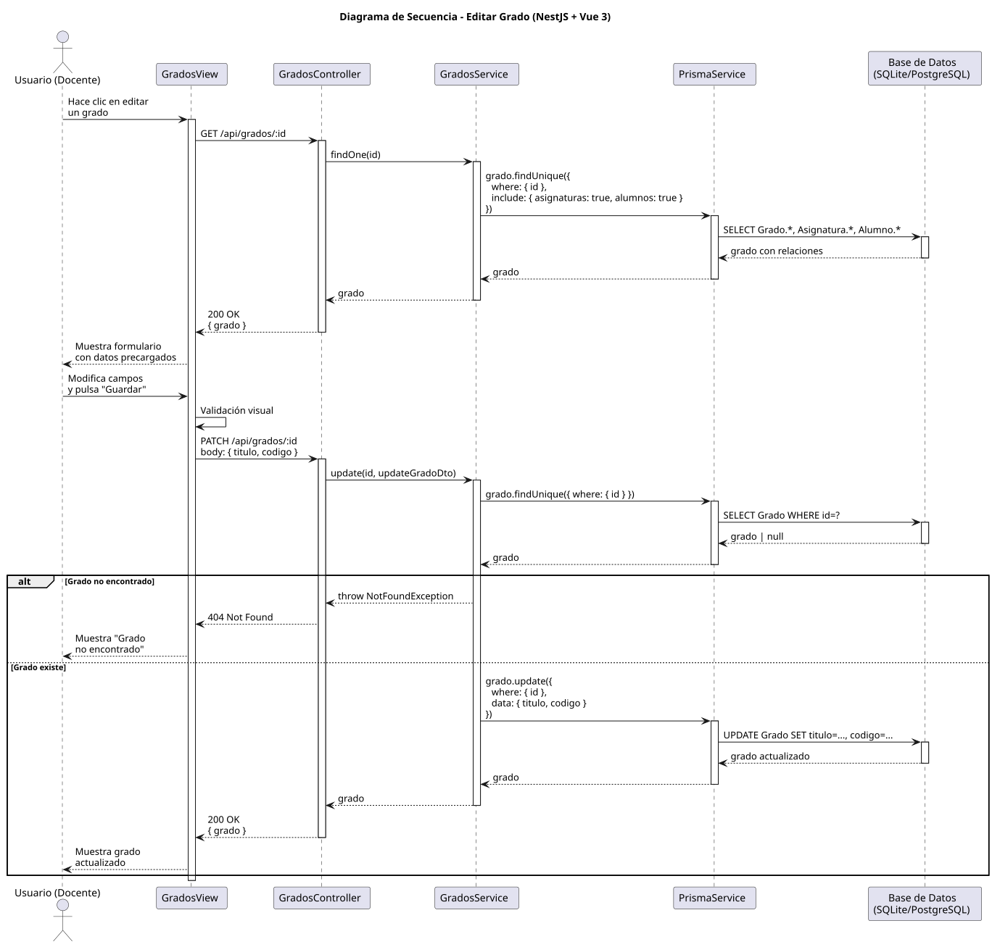
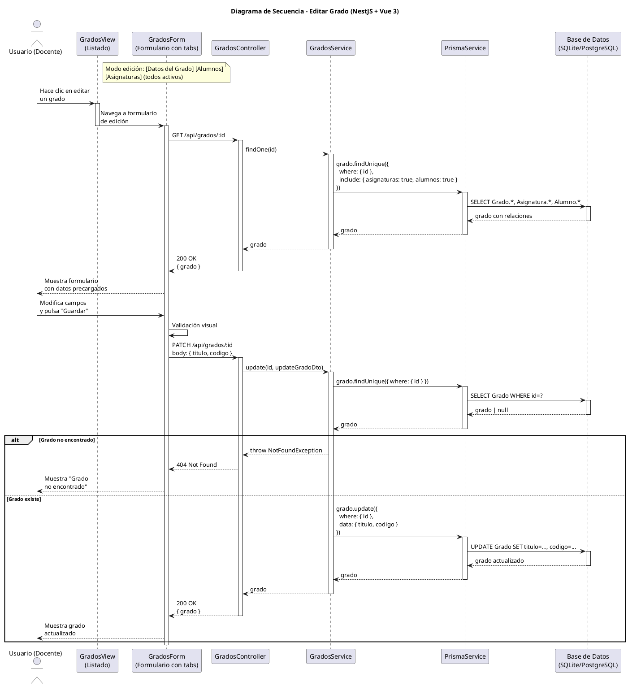

# 25-26-idsw2-sdVC > editarGrado > Diseño

## Información del artefacto

| Campo | Valor |
|-------|-------|
| **Proyecto** | Sistema de Gestión de Exámenes Universitarios |
| **Fase RUP** | Elaboración |
| **Disciplina** | Diseño |
| **Versión** | 1.0 (NestJS + Vue 3) |
| **Fecha** | 2026-06-09 |
| **Autor** | Marcos Gutierrez |

## Propósito

Detallar la interacción entre los componentes del sistema para editar un grado existente, incluyendo la carga previa de datos, modificación de campos y persistencia de cambios.

## Diagrama de secuencia de diseño

||
|-|
|Código fuente: [secuencia.puml](../../../modelosUML/diseño/editarGrado/secuencia.puml)|

## Código PlantUML

## Participantes

| Componente | Responsabilidad |
|---|---|
| **GradosView (Listado)** | Vista que muestra el listado de grados. El usuario hace clic en "Editar" para navegar al formulario de edición. |
| **GradosForm (Formulario con tabs)** | Formulario con tabs: [Datos del Grado] [Alumnos] [Asignaturas] (todos activos en modo edición). Muestra datos precargados del grado con sus relaciones. Validación visual antes de enviar. |
| **GradosController** | Endpoints `GET /:id` y `PATCH /:id` protegidos por guards JWT + Roles. |
| **GradosService** | Métodos `findOne()` (carga con include) y `update()` (verificación + persistencia). |
| **PrismaService** | Capa ORM que ejecuta las consultas de lectura y actualización. |
| **Base de Datos (SQLite/PostgreSQL)** | Almacena el grado y sus relaciones. |

## Decisiones de diseño

| Decisión | Justificación |
|---|---|
| **Carga previa con include** | `findOne()` incluye `asignaturas` y `alumnos` para mostrar relaciones en la vista de edición. |
| **Verificación de existencia en update** | `update()` llama a `findOne()` primero para lanzar 404 si el grado no existe. |
| **DTO parcial** | `UpdateGradoDto` permite modificar solo los campos enviados (PATCH semantics). |
| **Validación visual en frontend** | El frontend valida campos obligatorios antes de enviar. |
| **Manejo de error 404** | Si el grado no existe, se lanza `NotFoundException` manejado globalmente. |
| **Seguridad por capas** | Solo `DOCENTE` o `ADMIN` pueden editar grados. |
| **Sin transaccionalidad explícita** | Operación de actualización simple sin necesidad de transacción. |
| **Respuesta completa** | El endpoint devuelve el grado actualizado con todas sus relaciones. |
