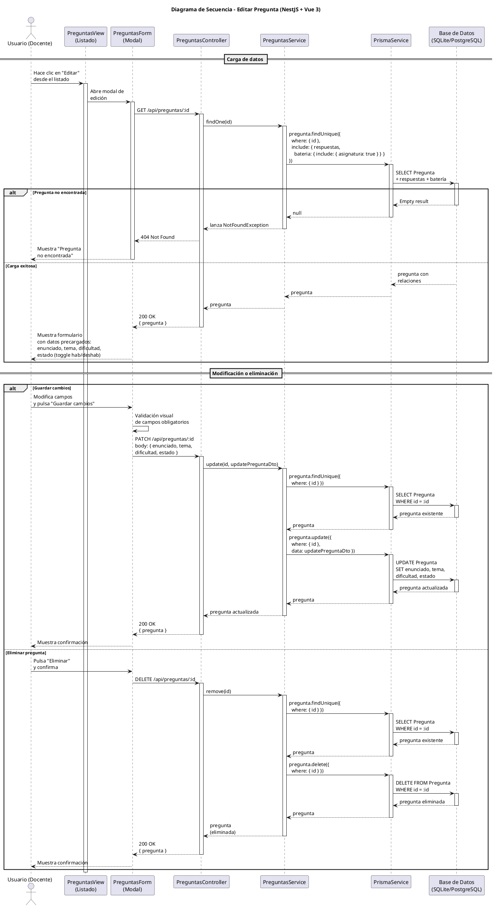

# 25-26-idsw2-sdVC > editarPregunta > Diseño

## Información del artefacto

| Campo | Valor |
|-------|-------|
| **Proyecto** | Sistema de Gestión de Exámenes Universitarios |
| **Fase RUP** | Elaboración |
| **Disciplina** | Diseño |
| **Versión** | 1.0 (NestJS + Vue 3) |
| **Fecha** | 2026-06-09 |
| **Autor** | Marcos Gutierrez |

## Propósito

Detallar la interacción entre los componentes del sistema para editar una pregunta existente (modificar enunciado, tema, dificultad, estado) o eliminarla, con verificación de existencia antes de cualquier operación y validación de campos en frontend.

## Diagrama de secuencia de diseño

||
|-|
|Código fuente: [secuencia.puml](../../../modelosUML/diseño/editarPregunta/secuencia.puml)|

## Código PlantUML

## Participantes

| Componente | Responsabilidad |
|---|---|
| **PreguntasView** | Vista que muestra el listado de preguntas. El usuario hace clic en "Editar" para abrir el modal de edición. |
| **PreguntasForm** | Modal de edición con datos precargados (enunciado, tema, dificultad, estado), permite modificar campos, guardar cambios, cancelar o eliminar la pregunta. Validación visual antes de enviar. |
| **PreguntasController** | Endpoints REST `GET /api/preguntas/:id` (carga de datos), `PATCH /api/preguntas/:id` (actualización) y `DELETE /api/preguntas/:id` (eliminación). Guards `JwtAuthGuard` + `RolesGuard` protegen los endpoints. |
| **PreguntasService** | Métodos `findOne()` (busca con include de respuestas y batería), `update()` (verifica existencia vía `findOne()` y luego persiste con Prisma) y `remove()` (verifica existencia vía `findOne()` y luego elimina). |
| **PrismaService** | Capa ORM que ejecuta `pregunta.findUnique()`, `pregunta.update()` y `pregunta.delete()` sobre el modelo Pregunta. |
| **Base de Datos (SQLite/PostgreSQL)** | Almacena y recupera los datos de la pregunta, sus respuestas y la batería asociada con su asignatura. |

## Decisiones de diseño

| Decisión | Justificación |
|---|---|
| **Carga previa de datos antes de editar** | El frontend solicita `GET /preguntas/:id` al abrir la edición para precargar todos los campos del formulario, incluyendo respuestas y asignatura. Esto permite al docente ver el estado actual completo antes de modificar. |
| **Verificación de existencia en update() y remove()** | Ambos métodos del servicio llaman a `findOne(id)` antes de operar. Si la pregunta fue eliminada entre la carga y la acción, se lanza `NotFoundException` (404). Esto evita errores crípticos de Prisma. |
| **Validación visual en frontend** | El frontend valida campos obligatorios antes de enviar el PATCH, evitando peticiones innecesarias al servidor. |
| **DTO con validación de NestJS** | `UpdatePreguntaDto` usa `class-validator` para validar tipos y valores opcionales (permite PATCH parcial, solo actualizando los campos enviados). |
| **Eliminación con confirmación** | Antes de enviar el DELETE, el frontend solicita confirmación al docente. Esto evita eliminaciones accidentales. |
| **Seguridad por capas** | `JwtAuthGuard` + `RolesGuard` protegen los tres endpoints. Solo `DOCENTE` o `ADMIN` pueden editar o eliminar preguntas. |
| **Respuestas incluidas en carga** | `findOne()` incluye `respuestas` y `bateria.asignatura` mediante Prisma `include`. Esto permite mostrar las respuestas existentes y la asignatura en el formulario de edición sin consultas adicionales. |
| **Sin transaccionalidad explícita** | Tanto `update()` como `remove()` son operaciones atómicas sobre una sola tabla que no requieren transacción. La verificación de existencia previa es suficiente para garantizar consistencia. |
