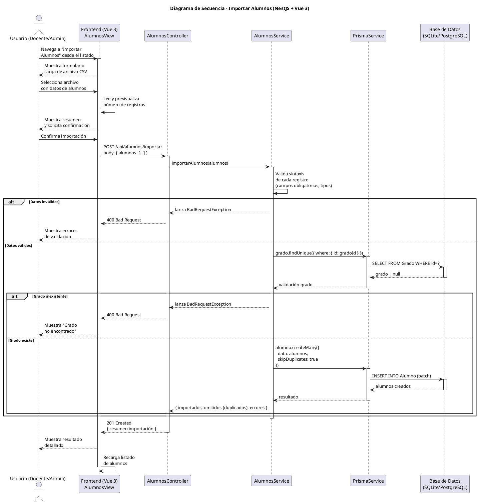

# 25-26-idsw2-sdVC > importarAlumnos > Diseño

## Información del artefacto

| Campo | Valor |
|-------|-------|
| **Proyecto** | Sistema de Gestión de Exámenes Universitarios |
| **Fase RUP** | Elaboración |
| **Disciplina** | Diseño |
| **Versión** | 1.0 (NestJS + Vue 3) |
| **Fecha** | 2026-06-03 |
| **Autor** | Marcos Gutierrez |

## Propósito

Detallar la interacción entre los componentes del sistema para importar alumnos de forma masiva desde un archivo CSV, validando los datos (formato, unicidad de DNI/email, existencia del grado) y persistiendo los registros válidos mediante operación batch.

## Diagrama de secuencia de diseño

||
|-|
|Código fuente: [secuencia.puml](../../../modelosUML/diseño/importarAlumnos/secuencia.puml)|

## Código PlantUML

## Participantes

| Componente | Responsabilidad |
|---|---|
| **Frontend (Vue 3)** | AlumnosView que permite al usuario cargar un archivo CSV, previsualizar los registros detectados y mostrar el resultado detallado de la importación. |
| **AlumnosController** | Endpoint REST `POST /api/alumnos/importar` que recibe el array de alumnos a importar. |
| **AlumnosService** | Lógica de validación sintáctica (campos obligatorios, tipos), validación semántica (existencia del grado), e importación batch con control de duplicados. |
| **PrismaService** | Capa ORM que ejecuta las operaciones de verificación y creación mediante `createMany` con `skipDuplicates`. |
| **Base de Datos (SQLite/PostgreSQL)** | Almacena los alumnos importados respetando las restricciones de unicidad (dni, email) y clave foránea (gradoId). |

## Decisiones de diseño

| Decisión | Justificación |
|---|---|
| **Validación en dos fases** | Validación sintáctica en el servicio (formato de cada registro) y validación semántica contra BD (existencia del grado), separando responsabilidades y evitando consultas innecesarias si el formato es inválido. |
| **Previsualización en frontend** | El frontend lee el archivo CSV y muestra un resumen de registros antes de enviar al backend, permitiendo al usuario confirmar antes de la importación. |
| **skipDuplicates para idempotencia** | `createMany` con `skipDuplicates: true` permite reimportar archivos sin errores por DNI o email duplicados, omitiendo los registros repetidos. |
| **Verificación de grado** | Se consulta la existencia del `gradoId` antes de persistir, garantizando integridad referencial. Si el grado no existe, se rechaza toda la operación. |
| **Formato CSV como estándar** | CSV es el formato más universal para importación de datos tabulares, fácil de generar desde Excel, Google Sheets u otras herramientas. |
| **Extensión de AlumnosService** | Se añade el método `importarAlumnos()` al `AlumnosService` existente en lugar de crear un servicio separado, manteniendo toda la lógica de alumnos unificada. |
| **Transaccionalidad por lote** | Toda la importación se ejecuta como una operación atómica: o se importan todos los alumnos válidos o se rechaza el lote completo. |
| **Seguridad por capas** | `JwtAuthGuard` + `RolesGuard` protegen el endpoint. Solo usuarios con rol `DOCENTE` o `ADMIN` pueden importar alumnos. |
