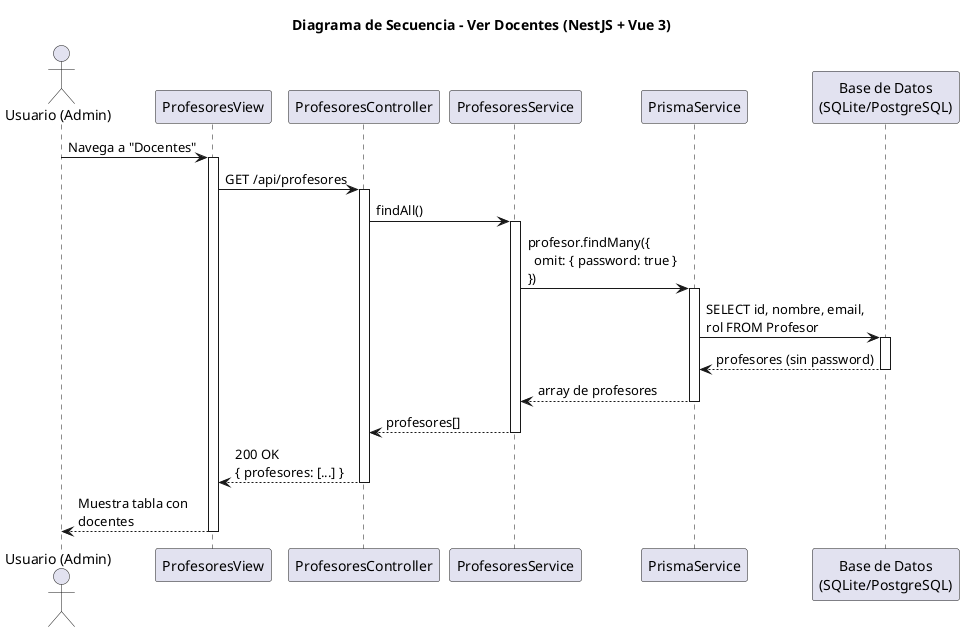

# 25-26-idsw2-sdVC > verDocentes > Diseño

## Información del artefacto

| Campo | Valor |
|-------|-------|
| **Proyecto** | Sistema de Gestión de Exámenes Universitarios |
| **Fase RUP** | Elaboración |
| **Disciplina** | Diseño |
| **Versión** | 1.0 (NestJS + Vue 3) |
| **Fecha** | 2026-06-09 |
| **Autor** | Marcos Gutierrez |

## Propósito

Visualizar el listado de docentes (profesores) excluyendo contraseñas. Solo acceso Administrador institucional.

## Diagrama de secuencia de diseño

||
|-|
|Código fuente: [secuencia.puml](../../../modelosUML/diseño/verDocentes/secuencia.puml)|

## Código PlantUML

## Participantes

| Componente | Responsabilidad |
|---|---|
| **ProfesoresView** | Vista para Administrador institucional. |
| **ProfesoresController** | Endpoint `GET /api/profesores`. |
| **ProfesoresService** | `findAll()` con `omit: { password: true }`. |
| **PrismaService** | Capa ORM. |
| **Base de Datos** | Almacena profesores. |

## Decisiones de diseño

| Decisión | Justificación |
|---|---|
| **Omit password** | `omit: { password: true }` excluye passwords de la respuesta por seguridad. |
| **Solo ADMIN** | RolesGuard permite solo Administrador institucional. |
| **Sin include** | No se requieren relaciones en el listado. |
| **Sin paginación** | Pocos registros. |
| **Caso de solo lectura** | Solo GET. |
